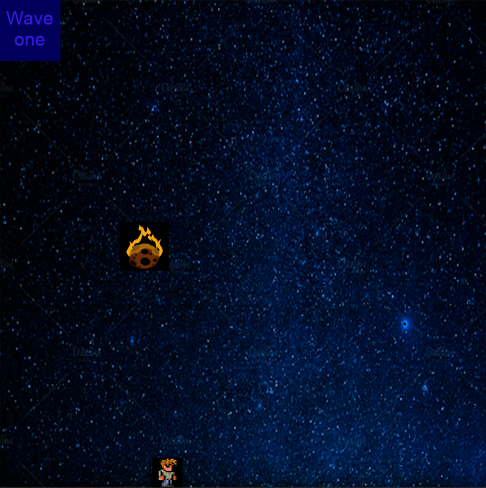
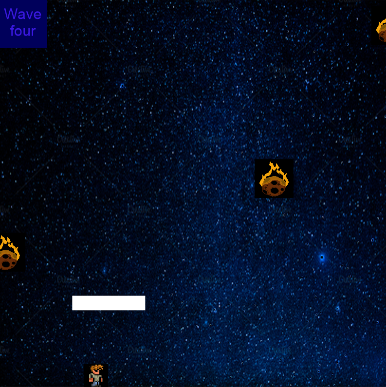

# Final Project

[](LICENSE)
[](docs/README.md)

Read [this document](https://cliutils.gitlab.io/modern-cmake/chapters/basics/structure.html) to understand the project
layout.

**Author**: Vikram Dara - [`vdara2@illinois.edu`](mailto:vdara2@illinois.edu)

# Falling Meteors


**What is it**
-

* This is a game made using CLion where a user has to dodge meteors
* Has four different waves where each consecutive wave is more difficult than the last
* Each wave lasts for 15 seconds and you must survive the full minute!




**Getting Started**
-

* This game is a CMake project so it is necessary to be installed
* Cinder is also necessary to be installed
    * The Cinder library which can be downloaded [here](https://libcinder.org/download)
    * If you are a Windows user download Visual Studio 2015, or get the 0.9.3 version of cinder and download Visual Studio 2019
    * Once you download it, extract the zip and then open the folder in your IDE, and finally click the build button
    * Add a new directory of any name and add a new directory in that. Then clone code into that subdirectory.
    
* Box2D is a library also used in this game, luckily implementing that is really easy
    * Cinder has some convenient macros to help us out
    * Go the the CMakeLists.txt files and find the ci_make_xxx macros and type in Box2D
       
    ```ci_make_app(
           APP_NAME    cinder-myapp
           CINDER_PATH ${CINDER_PATH}
           SOURCES     ${SOURCE_LIST}
           LIBRARIES   mylibrary
           BLOCKS Box2D <------ Just type this!
       )